## Advanced Lane Finding
[](http://www.udacity.com/drive)

The goals / steps of this project are the following:

* Compute the camera calibration matrix and distortion coefficients given a set of chessboard images.
* Apply a distortion correction to raw images.
* Use color transforms, gradients, etc., to create a thresholded binary image.
* Apply a perspective transform to rectify binary image ("birds-eye view").
* Detect lane pixels and fit to find the lane boundary.
* Determine the curvature of the lane and vehicle position with respect to center.
* Warp the detected lane boundaries back onto the original image.
* Output visual display of the lane boundaries and numerical estimation of lane curvature and vehicle position.

## Writeup
All the code related to this project located in this [jupyter notebook](https://github.com/samuelpfchoi/CarND-P4-Advanced-Lane-Lines/blob/master/P4.ipynb)

### Camera Calibration
The code for this step located in Camera Calibration section of [the notebook](https://github.com/samuelpfchoi/CarND-P4-Advanced-Lane-Lines/blob/master/P4.ipynb).

I start by preparing "object points", which will be the (x, y, z) coordinates of the chessboard corners in the world. Here I am assuming the chessboard is fixed on the (x, y) plane at z=0, such that the object points are the same for each calibration image.  Thus, `objp` is just a replicated array of coordinates, and `objpoints` will be appended with a copy of it every time I successfully detect all chessboard corners in a test image.  `imgpoints` will be appended with the (x, y) pixel position of each of the corners in the image plane with each successful chessboard detection.  

I then used the output `objpoints` and `imgpoints` to compute the camera calibration and distortion coefficients using the `cv2.calibrateCamera()` function.  I applied this distortion correction to the test image using the `cv2.undistort()` function and obtained this result: 

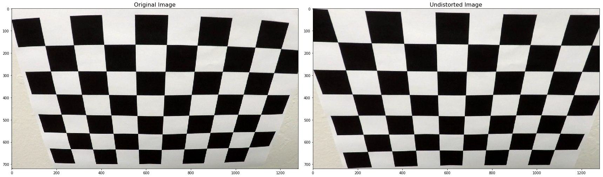


### Pipeline (single images)
This pipeline involves number of steps:
* Distortion correction
* Color/Gradient thresholding
* Perspective transform
* Finding the lines
* Calculating curvature of lane & position of vehicle

#### 1. Distortion Correction
Just as previous section, The result of camera calibration was applied to undistort the iamges taken with the camera. The following images show the before and after applying the distortion correction to a test image.

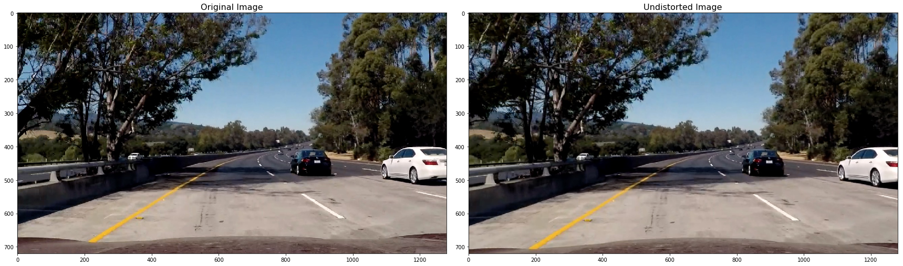

#### 2. Color/Gradient Thresholding
I used a combination of color and gradient thresholds to generate a binary image (thresholding steps in Color / Gradient Thresholding section of [the notebook](https://github.com/samuelpfchoi/CarND-P4-Advanced-Lane-Lines/blob/master/P4.ipynb)).  Here's an example of my output for this step.

The thresholding techniques include:
* Sobel gradient thresholding
* Gradient magnitude thresholding
* Gradient direction thresholding
* HLS color thresholding (L & S channels)

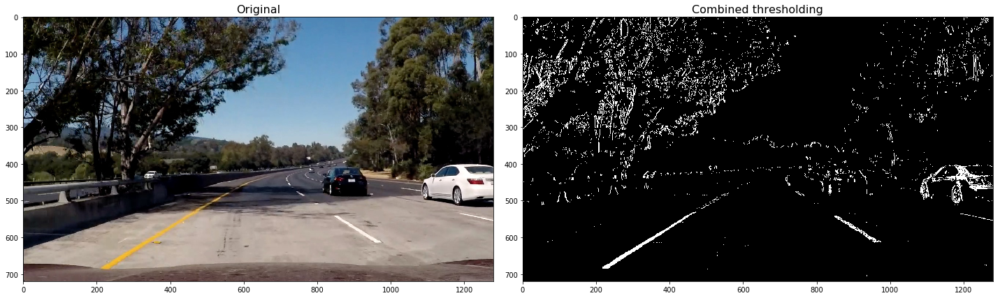

#### 3. Perpsective transform

After applying the areas of interest, Perspective transform was used on the parts of the road the lane markings are on to get a bird's eye view of the lane.

The code for my perspective transform includes a function called `perspect_transform()`, which appears in Perspective Transform section of  [the notebook](https://github.com/samuelpfchoi/CarND-P4-Advanced-Lane-Lines/blob/master/P4.ipynb).  The `perspect_transform()` function takes as inputs an image (`img`), as well as source (`src`) and destination (`dst`) points.  I chose the hardcode the source and destination points in the following manner:

```python
src = np.float32(
    [[739, 478], 
    [1035 ,662],
    [284, 662], 
    [549, 478]])
dsr = np.float32(
    [[1035-20, 260],
    [1035-20, 662],
    [284+20, 662],
    [284+20, 260]])
```

This resulted in the following source and destination points:

| Source        | Destination   | 
|:-------------:|:-------------:| 
| 739, 478      | 1015, 260     | 
| 1035, 662     | 1015, 662     |
| 284, 662      | 304, 662      |
| 549, 478      | 304, 662      |

I verified that my perspective transform was working as expected by drawing the `src` and `dst` points onto a test image and its warped counterpart to verify that the lines appear parallel in the warped image.

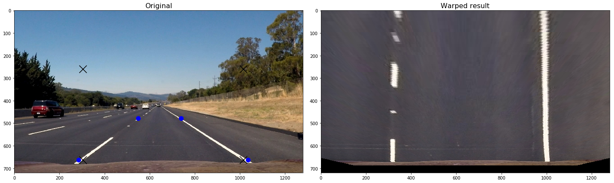

#### 4. Finding the lines

After completing the above steps, I got a binary image where the lane lines stand out clearly. Then I use sliding window search to identify pixels of left & right lane lines and fit my lane lines with a 2nd order polynomial kinda like this:

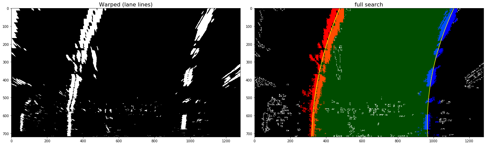
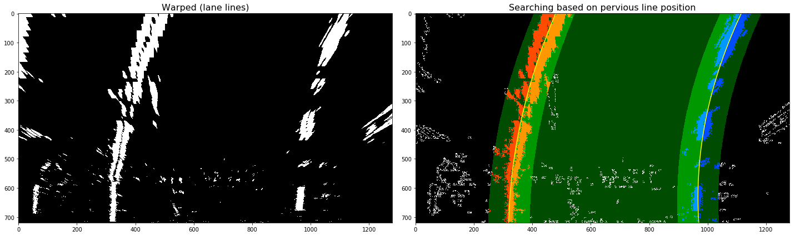

#### 5. Calculating curvature of lane & position of vehicle
I did this in Measuring Curvature & Position section of  [the notebook](https://github.com/samuelpfchoi/CarND-P4-Advanced-Lane-Lines/blob/master/P4.ipynb).

#### More images showing how the pipline works
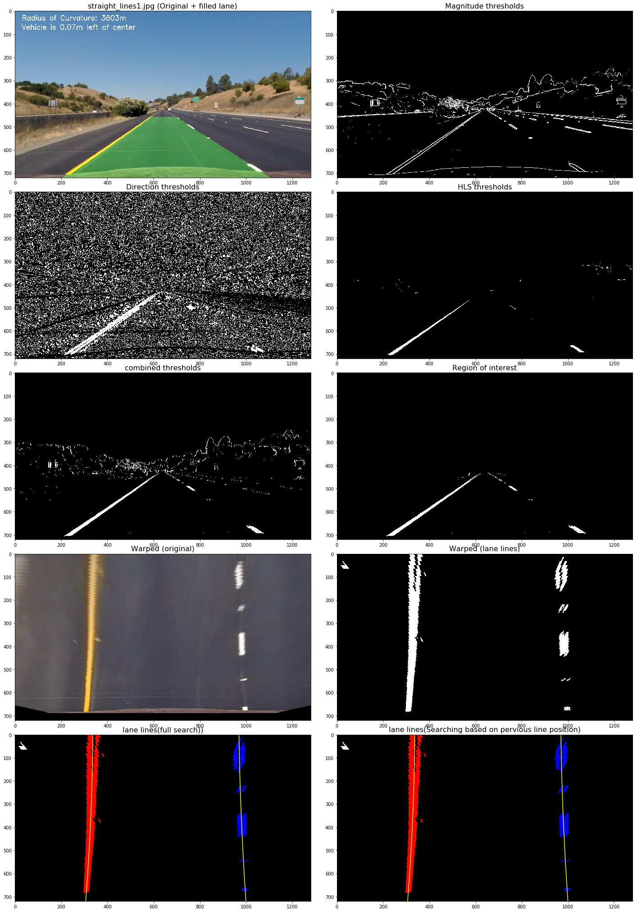
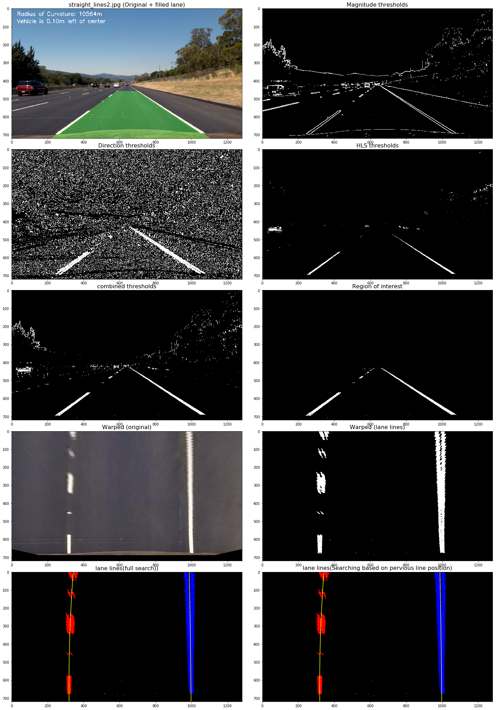
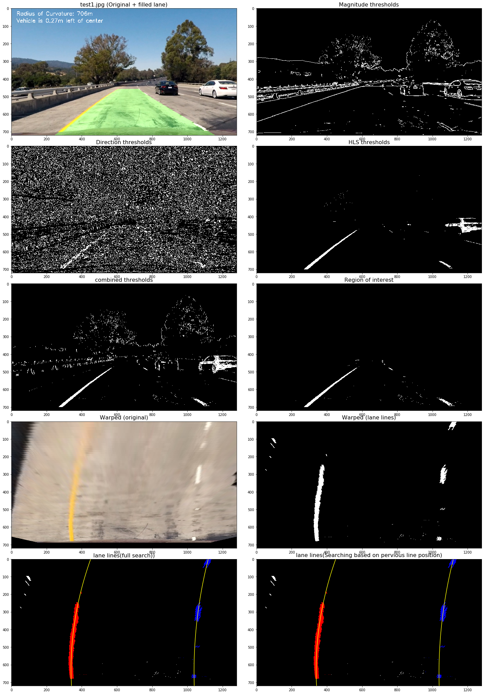
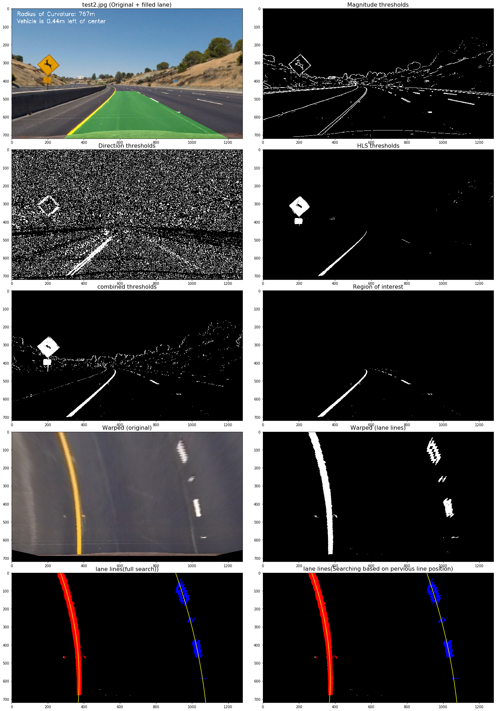
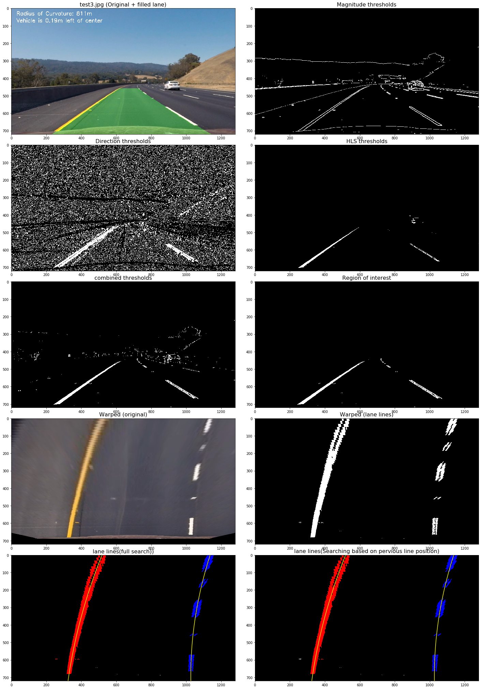
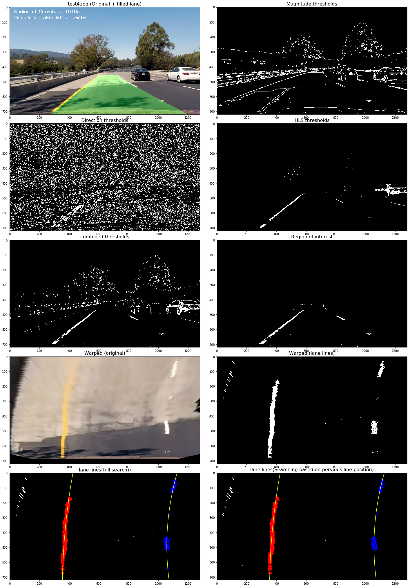
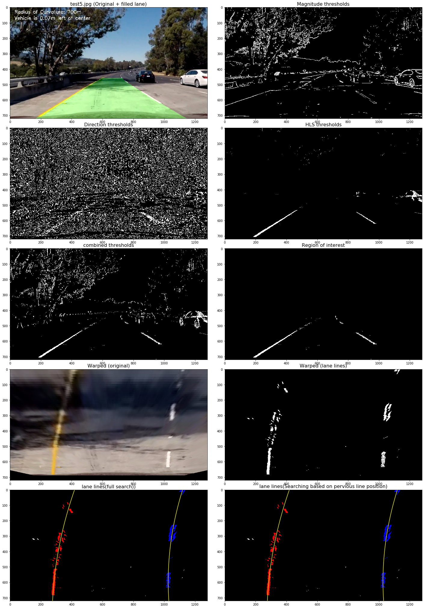
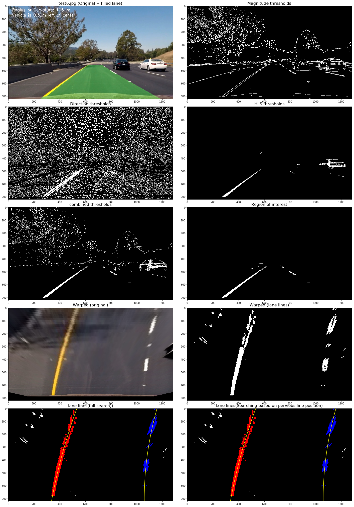


### Pipeline (video)

Here's a [link to my video result](./output_project_video.mp4)

<p align="center">
    <a href="https://www.youtube.com/watch?v=c5uK481d7Is">
        
    </a>
</p>


### Discussion
Problems / issues faced in the implementation of this project:
* How to choose the source and destination points for persective transformation
* No systematic approach to find the parameters for image thresholding
* difficult to varify the correctness of curvature measurement & vechicle position

Potential problem:
This pipline works well in the project video but it still need more advanced way to handle different road and light conditions, e.g. in rainly day or glare from the sun. Maybe machine learning can be used to make the pipline more robustness.
